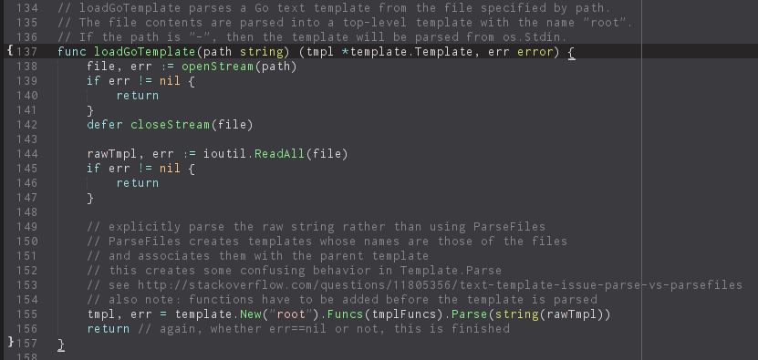

# COLOR CHOICES

pallor's colors are heavily derivative from zenburn. It uses a total of ten colors, five monotones and five highlights. I consider the very low color count of pallor to be a feature. (To be fair to base16, you really only need five monotones at a time, and most base16 themes have eight, so it's more like base13.)

The monotones are all shades of gray. In particular, I dislike having background colors that are clearly non-gray (this is the main thing I dislike about Solarized).

- `#383838` (background)
- `#d8d8d8` (foreground)
- `#303030` (line highlight)
- `#808080` (comment)
- `#80808060` (selection - semitransparent)

The highlights are very close to ones used in zenburn.

- red `#d88888` (strings, emphasized markup)
- blue `#88d8d8` (keywords, HTML tags/JSON and YAML keys, raw markup)
- orange `#ffb870` (constants/literals, markup images)
- yellow `#ffff88` (types/classes markup headings)
- green `#70d070` (functions, HTML attributes, markup links)

The RGB values are all divisible by 8, not for any real reason, but because I like rounded numbers. /shrug

The Solarized documentation refers to the comment color as "secondary content". I like that term. pallor considers a lot of things to be "secondary content" - not just comments, but also the targets of links and images in markup, and the quotes around strings. After getting used to the de-emphasized quotes in zenburn, I find this effect quite appealing.

## CIELAB colors

Although I don't like how Solarized looks, I find the design behind it to be very interesting, so I decided to look at the CIELAB values of pallor colors and... shuffle them around a bit.You can see the results in [lab.json](lab.json), and the resulting theme, [palLAB.tmTheme](palLAB.tmTheme). Disclaimer: color science is quite complicated, I have no idea what I'm doing.

Here are the `L*a*b*` colors in palLAB. All colors are relative to D50. First, the monotones. The comment lightness is halfway between the background and foreground lightness. Also note that the line highlight is considerably darker (-5 lightness from the original color).

- `25 0 -10` `#3b3b3f` (background)
- `85 0 -20` `#d7d3d8` (foreground)
- `15 0 -5` `#272525` (line highlight)
- `55 0 -15` `#858388` (comment)
- `#85838860` (selection)

Now, the accents. All of them have been adjusted to 85 lightness to match the foreground.

- red `85 25 0` `#ffc0b7`
- blue `85 -25 -25` `#99e1e0`
- orange `85 15 35``#ffc67a`
- yellow `85 -20 40` `#d4db6e`
- green `85 -20 25` `#89ea88`

This is a piece of Go code (from jgtr), in palLAB:

I think palLAB is interesting, but I don't like how it looks. The background is distinctly blue (too much for me), which makes the theme a bit too cold and makes it feel "contrastier". I can't decide whether the line highlight is too dark or just right. The red is also significantly lighter (+20 lightness) which makes it really washed out, and not distinct enough. In particular, I find red and orange can be confused.

That being said, the two themes "feel" surprisingly similar. If you put them side by side, they look alike (setting aside the background and line highlight differences, which are probably the most severe changes). Perhaps I'll try this experiment again in the future.
