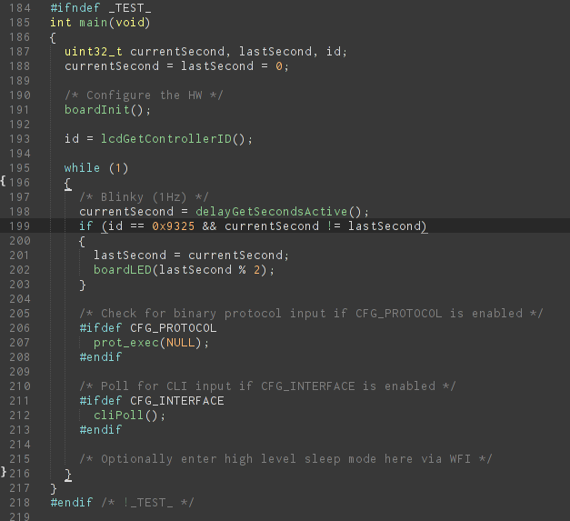
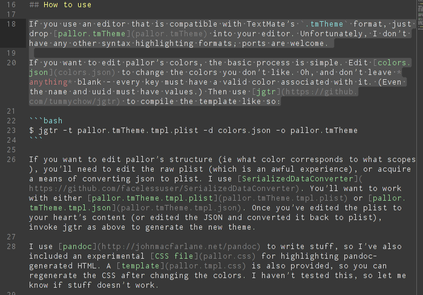
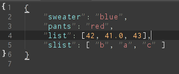

# SAMPLES

Screenshots of pallor in action! The editor is Sublime Text 2 with the Soda Dark theme (although you can't see much of it). The font is Inconsolata, with improved hinting from [Google Fonts](http://code.google.com/p/googlefontdirectory/source/browse/ofl/inconsolata/).

## C

The code is from the main function for [one of my projects](https://github.com/tummychow/arm-alarm).

## Go

The code is from [Cobra](https://github.com/spf13/cobra).

## CSS

This is a fragment of the CSS that GitHub uses to style Markdown. I think I got it from [cutemarked](https://github.com/cloose/cutemarked).

## Markdown

This is a fragment of the pallor [README](README.md).

Here's another sample from the same document. This shows how pallor looks when you select text. Note the contrast between the dark gray links (comment color) and the selection highlighting. Personally I think it's pretty good.

## JSON and YAML

These are some sample files that I used to test [jgtr](https://github.com/tummychow/jgtr). Note how the JSON keys are highlighted differently from the values. Due to the issues with the TextMate JSON grammar, this is only possible through a messy hack.

